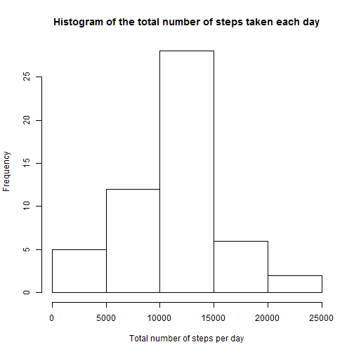
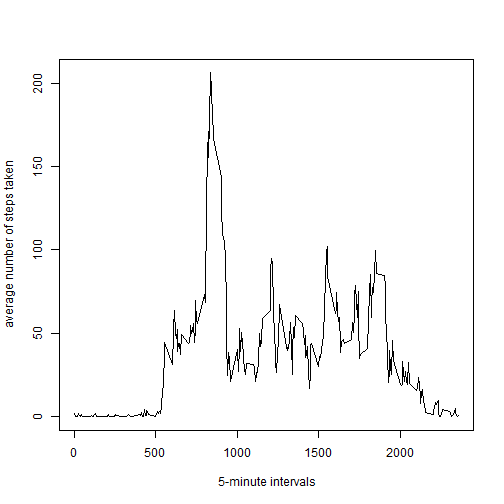
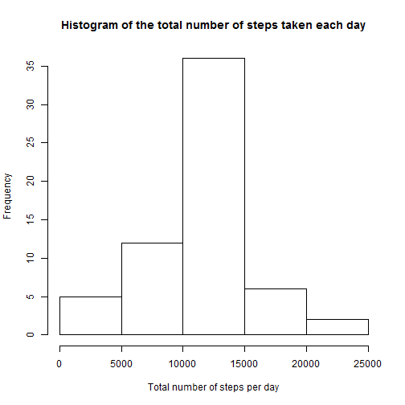
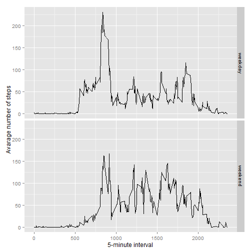

```r
library(plyr)
library(ggplot2)
```

## Loading and preprocessing the data

#### 1. Load the data (i.e. read.csv())


```r
df <- read.csv(unz("activity.zip", "activity.csv"))
```


#### 2. Process/transform the data (if necessary) into a format suitable for your analysis


```r
df$date <- as.Date(df$date, "%Y-%m-%d")
```


## What is mean total number of steps taken per day?

#### 1. Calculate the total number of steps taken per day

```r
steps_by_day <- ddply(df, .(date), summarize, count=sum(steps))
```

#### 2. Make a histogram of the total number of steps taken each day

```r
hist(steps_by_day$count, xlab = "Total number of steps per day", main = "Histogram of the total number of steps taken each day")
```

 

#### 3. Calculate and report the mean and median of the total number of steps taken per day

```r
t_mean <- mean(steps_by_day$count, na.rm = TRUE)
t_median <- median(steps_by_day$count, na.rm = TRUE)
t_mean
```

```
## [1] 10766.19
```

```r
t_median
```

```
## [1] 10765
```

Mean of total number of steps taken per day is **10766.19**. Median of total number of steps taken per day is **10765**.

## What is the average daily activity pattern?

#### 1. Make a time series plot (i.e. type = "l") of the 5-minute interval (x-axis) and the average number of steps taken, averaged across all days (y-axis)

```r
steps_by_time <- ddply(df, .(interval), summarize, avg=mean(steps, na.rm = TRUE))
plot(steps_by_time$interval, steps_by_time$avg, type = "l", xlab = " 5-minute intervals", ylab = "average number of steps taken")
```

 

#### 2. Which 5-minute interval, on average across all the days in the dataset, contains the maximum number of steps?

```r
max_steps <- max(steps_by_time$avg)
max_step_interval <- steps_by_time$interval[which.max(steps_by_time$avg)]
max_step_interval
```

```
## [1] 835
```

The 5-minute interval that contains the maximum number of steps (on average across all days in the dataset) is **835**. The maximum namber of steps is **206.1698**.

## Imputing missing values

#### 1. Calculate and report the total number of missing values in the dataset (i.e. the total number of rows with NAs)

```r
missing_values_count <- length(which(is.na(df$steps)))
missing_values_count
```

```
## [1] 2304
```
Number of missing values is **2304**.

#### 2. Devise a strategy for filling in all of the missing values in the dataset. The strategy does not need to be sophisticated.

Examination of the dataset shows that the missing values are contained in the 'steps' column only and are grouped by day. There are 8 days with all 'steps' values equal to NA. This means we can't calculate mean or median for those days. So we can try the approach with the mean for each 5-minite interval.

#### 3. Create a new dataset that is equal to the original dataset but with the missing data filled in.


```r
# copy the original dataframe with NAs
df_filled <- df
# find indecies of NA records
na_positions <- which(is.na(df$steps), arr.ind=TRUE)
# fill NA step values with average step values for that particular 5-minute interval
df_filled$steps[na_positions] <- rep(steps_by_time$avg, length.out = nrow(df))[na_positions]
```

#### 4. Make a histogram of the total number of steps taken each day and Calculate and report the **mean** and **median** total number of steps taken per day. Do these values differ from the estimates from the first part of the assignment? What is the impact of imputing missing data on the estimates of the total daily number of steps?

```r
steps_corrected_by_day <- ddply(df_filled, .(date), summarize, count=sum(steps))
hist(steps_corrected_by_day$count, xlab = "Total number of steps per day", main = "Histogram of the total number of steps taken each day")
```

 


```r
t_mean <- mean(steps_corrected_by_day$count, na.rm = TRUE)
t_median <- median(steps_corrected_by_day$count, na.rm = TRUE)
t_mean
```

```
## [1] 10766.19
```

```r
t_median
```

```
## [1] 10766.19
```

Mean of total number of steps taken per day is **10766.19**. Median of total number of steps taken per day is **10766.19**.

The mean is unchanged but the median has changed and is now equal to the mean. The impact of imputing is that there is more data now and the median value changes.

## Are there differences in activity patterns between weekdays and weekends?

#### 1. Create a new factor variable in the dataset with two levels – “weekday” and “weekend” indicating whether a given date is a weekday or weekend day.


```r
df_filled$dateType <-  ifelse(as.POSIXlt(df_filled$date)$wday %in% c(0, 6), 'weekend', 'weekday')
```


#### 2. Make a panel plot containing a time series plot (i.e. type = "l") of the 5-minute interval (x-axis) and the average number of steps taken, averaged across all weekday days or weekend days (y-axis).


```r
df_filled_avg <- aggregate(steps ~ interval + dateType, data=df_filled, mean)
ggplot(df_filled_avg, aes(interval, steps)) + 
    geom_line() + 
    facet_grid(dateType ~ .) +
    xlab("5-minute interval") + 
    ylab("Avarage number of steps")
```

 

